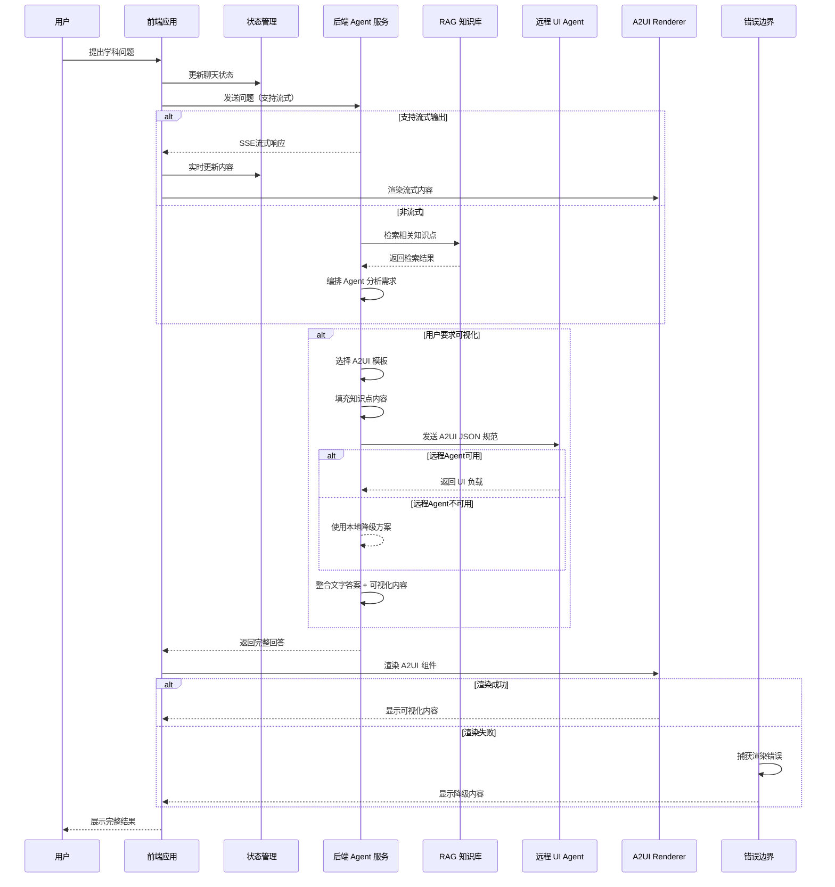
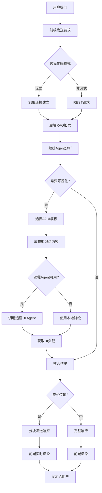

# A2UI 集成实现计划（增强版）

## 1. 项目现状与对比分析

### 1.1 现有架构
- **前端**：React + TypeScript，40+ 遗传学可视化组件，基础 A2UI 解析器
- **后端**：NestJS，VisualDesigner 服务，RAG 检索系统
- **数据**：完整的遗传学知识库，向量存储系统
- **状态管理**：React Hooks + Context API（现有），考虑引入 Zustand/Redux
- **构建工具**：Vite

### 1.2 与参考项目的对比分析

| 对比维度 | 我们的AhaTutor项目 | 参考项目（Vue） | 改进借鉴点 |
|----------|-------------------|-------------------|--------------|
| **技术栈** | React + TypeScript | Vue 3 + Composition API | 借鉴组件设计模式，适配React生态 |
| **流式输出** | 基础流式支持 | 完善的SSE流式输出 | 增强流式渲染机制 |
| **组件设计** | 40+ 遗传学组件 | 基础UI组件（Button、Card等） | 建立分层组件架构 |
| **状态管理** | React Hooks | Pinia | 引入状态管理最佳实践 |
| **性能优化** | 基础优化 | 虚拟滚动、懒加载等完整策略 | 添加性能优化方案 |
| **错误处理** | 基础异常处理 | 完善的降级策略 | 建立错误边界机制 |
| **测试覆盖** | 部分后端测试 | 完整的测试策略 | 制定测试计划 |

### 1.3 优势
- 已有成熟的遗传学可视化组件库（40+ 专业组件）
- 后端具备完整的 Agent 流水线和 RAG 系统
- 前端已实现基础 A2UI 解析
- 丰富的遗传学领域知识库
- 清晰的模块化架构

### 1.4 挑战
- 缺少标准 A2UI Renderer 集成
- 后端 Agent 输出格式需要标准化
- 缺少远程 UI Agent 调用机制
- 前端组件需要适配 A2UI 规范
- 缺少完整的性能优化策略
- 测试覆盖率需要提升

## 2. 技术方案架构（增强版）

### 2.1 系统架构设计



### 2.2 增强版模块划分

| 模块 | 职责 | 技术栈 | 文件位置 | 借鉴点 |
|------|------|--------|----------|----------|
| **A2UI 模板管理** | 定义和管理 A2UI 模板 | TypeScript | `src/backend/src/modules/agents/data/a2ui-templates.data.ts` | 模板化设计 |
| **后端 A2UI 适配器** | 转换可视化数据为 A2UI 格式 | TypeScript | `src/backend/src/modules/agents/a2ui-adapter.service.ts` | 适配器模式 |
| **远程 UI Agent 客户端** | 与远程 UI Agent 通信 | TypeScript | `src/backend/src/modules/agents/remote-ui-agent.service.ts` | 降级策略 |
| **前端 A2UI 注册表** | 注册自定义 A2UI 组件 | TypeScript | `src/frontend/src/components/A2UI/registry.ts` | 组件注册机制 |
| **A2UI Renderer 集成** | 渲染 A2UI 组件 | React + A2UI | `src/frontend/src/components/A2UI/Renderer.tsx` | 流式渲染 |
| **A2UI 组件适配器** | 适配现有组件到 A2UI 规范 | React | `src/frontend/src/components/A2UI/adapters/` | 组件适配层 |
| **状态管理增强** | 管理 A2UI 相关状态 | Zustand/Redux | `src/frontend/src/stores/a2uiStore.ts` | Pinia设计思路 |
| **流式输出处理器** | 处理 SSE 流式响应 | TypeScript | `src/frontend/src/utils/streamingProcessor.ts` | SSE处理优化 |
| **错误边界** | 捕获和处理 A2UI 渲染错误 | React | `src/frontend/src/components/A2UI/ErrorBoundary.tsx` | 错误处理 |
| **性能监控** | 监控渲染性能和用户体验 | TypeScript | `src/frontend/src/utils/performanceMonitor.ts` | 性能优化 |
| **AI 对话流程管理** | 处理 AI 对话和可视化触发 | TypeScript | `src/frontend/src/components/A2UI/ChatFlow.tsx` | 流程管理 |

### 2.3 接口定义（增强版）

#### 2.3.1 后端接口

| 接口 | 方法 | 路径 | 功能 | 流式支持 |
|------|------|------|------|----------|
| A2UI 模板获取 | GET | `/api/agent/a2ui/templates` | 获取所有 A2UI 模板 | 否 |
| 可视化转 A2UI | POST | `/api/agent/a2ui/convert` | 将可视化数据转换为 A2UI 格式 | 否 |
| 远程 UI Agent 调用 | POST | `/api/agent/a2ui/remote` | 调用远程 UI Agent | 否 |
| AI 对话 + 可视化（流式） | POST | `/api/agent/chat/visualize/stream` | AI 对话结合可视化（SSE） | 是 |
| AI 对话 + 可视化 | POST | `/api/agent/chat/visualize` | AI 对话结合可视化（REST） | 否 |
| 健康检查 | GET | `/api/agent/a2ui/health` | A2UI 服务健康检查 | 否 |

#### 2.3.2 前端接口

| 函数 | 参数 | 返回值 | 功能 | 借鉴点 |
|------|------|--------|------|----------|
| `registerA2UIComponents()` | `registry: A2UIComponentRegistry` | `void` | 注册 A2UI 组件 | 组件注册机制 |
| `renderA2UIPayload()` | `payload: A2UIPayload` | `React.ReactNode` | 渲染 A2UI 负载 | 动态渲染 |
| `askWithVisualization()` | `question: string, concept: string, options: ChatOptions` | `Promise<ChatResponse>` | 带可视化的 AI 对话 | 流式处理 |
| `handleA2UIEvent()` | `event: A2UIEvent` | `void` | 处理 A2UI 事件 | 事件处理 |
| `streamA2UIResponse()` | `response: Response, onChunk: Function, onComplete: Function` | `void` | 处理流式 A2UI 响应 | SSE处理 |
| `getA2UITemplate()` | `type: VisualizationType` | `Promise<A2UITemplate>` | 获取指定类型的 A2UI 模板 | 模板管理 |

## 3. 分步实现计划（增强版）

### 阶段 1：基础架构准备（2-3 天）

#### 任务 1.1：创建 A2UI 模板库
- [x] 实现 `a2ui-templates.data.ts`
- [x] 定义标准 A2UI 模板格式
- [x] 为主要可视化类型创建模板
- [ ] 增加更多遗传学可视化模板
- [ ] 建立模板版本管理机制

#### 任务 1.2：扩展前端 A2UI 解析器
- [ ] 扩展 `a2ui-parser.ts` 支持更多组件类型
- [ ] 添加 A2UI 组件注册机制
- [ ] 实现 A2UI 事件处理
- [ ] 支持 A2UI 增量更新机制

#### 任务 1.3：集成 A2UI Renderer
- [ ] 安装 A2UI Web Renderer（或创建轻量级适配器）
- [ ] 创建 A2UI 组件适配器层
- [ ] 实现基础渲染功能
- [ ] 建立组件映射和注册表

#### 任务 1.4：建立状态管理
- [ ] 选择并集成状态管理库（推荐 Zustand）
- [ ] 创建 A2UI 相关状态管理
- [ ] 实现流式输出状态管理
- [ ] 集成到现有状态管理架构

### 阶段 2：后端改造（3-4 天）

#### 任务 2.1：创建 A2UI 适配器服务
- [ ] 实现 `a2ui-adapter.service.ts`
- [ ] 集成 A2UI 模板管理
- [ ] 实现可视化数据转换
- [ ] 添加模板匹配和选择逻辑

#### 任务 2.2：改造 VisualDesigner 服务
- [ ] 修改输出格式为 A2UI 标准
- [ ] 集成 A2UI 模板选择逻辑
- [ ] 优化 RAG 检索结果处理
- [ ] 支持流式 A2UI 输出

#### 任务 2.3：实现远程 UI Agent 客户端
- [ ] 创建 `remote-ui-agent.service.ts`
- [ ] 实现 HTTP 客户端通信
- [ ] 添加错误处理和重试机制
- [ ] 实现降级策略（本地模板渲染）

#### 任务 2.4：实现流式输出支持
- [ ] 添加 SSE 端点
- [ ] 实现流式 A2UI 负载传输
- [ ] 优化流式输出性能
- [ ] 添加流式状态管理

### 阶段 3：前端集成（3-4 天）

#### 任务 3.1：创建 A2UI 注册表
- [ ] 实现 `A2UI/registry.ts`
- [ ] 注册所有可视化组件
- [ ] 配置组件映射关系
- [ ] 建立组件版本管理

#### 任务 3.2：开发 A2UI Renderer 组件
- [ ] 实现 `A2UI/Renderer.tsx`
- [ ] 支持动态组件加载
- [ ] 处理 A2UI 交互事件
- [ ] 实现流式内容渲染

#### 任务 3.3：实现 AI 对话流程
- [ ] 创建 `A2UI/ChatFlow.tsx`
- [ ] 集成后端对话接口
- [ ] 实现可视化触发逻辑
- [ ] 支持流式输出处理

#### 任务 3.4：创建错误边界
- [ ] 实现 `A2UI/ErrorBoundary.tsx`
- [ ] 捕获 A2UI 渲染错误
- [ ] 提供降级 UI
- [ ] 添加错误报告机制

#### 任务 3.5：实现组件适配器
- [ ] 为现有组件创建适配器
- [ ] 转换 props 格式到 A2UI 标准
- [ ] 处理事件和数据流
- [ ] 保持组件原有功能

### 阶段 4：功能整合与优化（2-3 天）

#### 任务 4.1：整合 AI 速通功能
- [ ] 集成 A2UI 到 SpeedModePage
- [ ] 实现完整的对话-可视化流程
- [ ] 优化用户交互体验
- [ ] 支持流式对话

#### 任务 4.2：添加错误处理机制
- [ ] 实现前端错误边界
- [ ] 后端异常处理
- [ ] 降级策略实现
- [ ] 错误日志和监控

#### 任务 4.3：性能优化
- [ ] 组件懒加载
- [ ] 虚拟滚动（针对大量组件列表）
- [ ] 数据缓存策略
- [ ] 渲染性能优化

#### 任务 4.4：流式输出优化
- [ ] 实现智能内容分割
- [ ] 优化打字机效果
- [ ] 支持流式状态可视化
- [ ] 添加流式控制功能（停止/继续）

## 4. 数据流转流程（增强版）

### 4.1 正常流程



### 4.2 异常处理流程（增强版）

| 异常类型 | 处理策略 | 降级方案 | 借鉴点 |
|----------|----------|----------|----------|
| RAG 检索失败 | 记录错误，使用默认知识点 | 基础文字回答 | 错误边界 |
| 远程 UI Agent 超时 | 重试3次，指数退避 | 本地模板渲染 | 降级策略 |
| A2UI 渲染失败 | 错误边界捕获 | 显示错误信息 + 基础组件 | 错误边界 |
| 模板匹配失败 | 使用通用模板 | 基础可视化 | 模板管理 |
| SSE 连接失败 | 自动切换到 REST | 非流式请求 | 兼容性处理 |
| 流式传输中断 | 保存已接收内容 | 显示部分结果 | 流式处理 |
| 组件加载失败 | 显示加载错误 | 降级到简单组件 | 错误处理 |

## 5. 组件设计优化（增强版）

### 5.1 分层组件架构

借鉴参考项目的分层设计，建立遗传学专属的组件层次：

```
┌─────────────────────────────────────┐
│   应用层               │
│   ┌─────────────────────────┐   │
│   │ AI对话流程管理         │   │
│   │ SpeedModePage        │   │
│   └─────────────────────────┘   │
└─────────────────────────────────────┘
            ↓
┌─────────────────────────────────────┐
│   功能组件层                │
│   ┌─────────────────────────┐   │
│   │ A2UIChatFlow         │   │
│   │ A2UIRenderer         │   │
│   │ StreamingProcessor     │   │
│   └─────────────────────────┘   │
└─────────────────────────────────────┘
            ↓
┌─────────────────────────────────────┐
│   A2UI组件适配层             │
│   ┌─────────────────────────┐   │
│   │ ComponentAdapters     │   │
│   │ - PunnettAdapter     │   │
│   │ - InheritanceAdapter  │   │
│   │ - KnowledgeAdapter    │   │
│   └─────────────────────────┘   │
└─────────────────────────────────────┘
            ↓
┌─────────────────────────────────────┐
│   基础组件层（遗传学）       │
│   ┌─────────────────────────┐   │
│   │ PunnettSquare       │   │
│   │ InheritancePath     │   │
│   │ KnowledgeGraph     │   │
│   │ ... (40+ 组件)    │   │
│   └─────────────────────────┘   │
└─────────────────────────────────────┘
```

### 5.2 A2UI 组件注册机制

```typescript
// src/frontend/src/components/A2UI/registry.ts

import { PunnettSquare } from '../Visualization/PunnettSquare';
import { InheritancePath } from '../Visualization/InheritancePath';
import { KnowledgeGraph } from '../Visualization/KnowledgeGraph';
import { MeiosisAnimation } from '../Visualization/MeiosisAnimation';
// ... 其他组件

interface A2UIComponentRegistry {
  [key: string]: {
    component: React.ComponentType<any>;
    adapter?: (props: any) => any;
    defaultProps?: Record<string, any>;
  };
}

export const A2UI_REGISTRY: A2UIComponentRegistry = {
  'ahatutor-punnett-square': {
    component: PunnettSquare,
    defaultProps: {
      colors: {
        dominant: '#4CAF50',
        recessive: '#FF9800',
        heterozygous: '#2196F3',
        male: '#64B5F6',
        female: '#F06292',
      }
    }
  },
  'ahatutor-inheritance-path': {
    component: InheritancePath,
    defaultProps: {
      layout: 'hierarchical',
      interactions: ['hover', 'click']
    }
  },
  'ahatutor-knowledge-graph': {
    component: KnowledgeGraph,
    defaultProps: {
      colors: {
        foundation: '#4CAF50',
        intermediate: '#2196F3',
        advanced: '#9C27B0',
        target: '#F44336',
      }
    }
  },
  'ahatutor-meiosis-animation': {
    component: MeiosisAnimation,
    defaultProps: {
      autoplay: true,
      loop: true,
      speed: 1
    }
  },
  // ... 注册其他组件
};

export function registerA2UIComponent(
  type: string, 
  component: React.ComponentType<any>,
  options?: {
    adapter?: (props: any) => any;
    defaultProps?: Record<string, any>;
  }
) {
  A2UI_REGISTRY[type] = {
    component,
    ...options
  };
}

export function getA2UIComponent(type: string) {
  return A2UI_REGISTRY[type]?.component;
}

export function getA2UIComponentAdapter(type: string) {
  return A2UI_REGISTRY[type]?.adapter;
}
```

### 5.3 组件适配器设计

```typescript
// src/frontend/src/components/A2UI/adapters/PunnettAdapter.tsx

import React from 'react';
import { PunnettSquare } from '../../Visualization/PunnettSquare';

interface A2UIPunnettProps {
  maleGametes: string[];
  femaleGametes: string[];
  parentalCross: {
    male: { genotype: string; phenotype: string };
    female: { genotype: string; phenotype: string };
  };
  offspring: Array<{
    genotype: string;
    phenotype: string;
    probability: number;
    sex?: 'male' | 'female';
  }>;
  description?: string;
  colors?: Record<string, string>;
}

export function PunnettAdapter(props: A2UIPunnettProps) {
  // 转换 A2UI 格式到组件期望的格式
  const adaptedProps = {
    data: {
      maleGametes: props.maleGametes,
      femaleGametes: props.femaleGametes,
      parentalCross: props.parentalCross,
      offspring: props.offspring,
      description: props.description,
    },
    colors: props.colors,
  };

  return <PunnettSquare {...adaptedProps} />;
}
```

## 6. 状态管理增强（借鉴Pinia设计）

### 6.1 Zustand 状态管理

```typescript
// src/frontend/src/stores/a2uiStore.ts

import { create } from 'zustand';

interface A2UIState {
  // 当前 A2UI 载载
  currentPayload: A2UIPayload | null;
  
  // 组件注册表
  registeredComponents: Record<string, boolean>;
  
  // 流式输出状态
  isStreaming: boolean;
  streamingContent: string;
  
  // 渲染状态
  isRendering: boolean;
  renderError: Error | null;
  
  // 性能监控
  renderTime: number;
  lastUpdated: number;
  
  // Actions
  setCurrentPayload: (payload: A2UIPayload) => void;
  registerComponent: (type: string) => void;
  startStreaming: () => void;
  appendStreamingContent: (content: string) => void;
  completeStreaming: () => void;
  setRendering: (isRendering: boolean) => void;
  setRenderError: (error: Error | null) => void;
  updatePerformance: (renderTime: number) => void;
}

export const useA2UIStore = create<A2UIState>((set) => ({
  currentPayload: null,
  registeredComponents: {},
  isStreaming: false,
  streamingContent: '',
  isRendering: false,
  renderError: null,
  renderTime: 0,
  lastUpdated: Date.now(),
  
  setCurrentPayload: (payload) => set({ 
    currentPayload: payload, 
    lastUpdated: Date.now() 
  }),
  
  registerComponent: (type) => set((state) => ({
    registeredComponents: { ...state.registeredComponents, [type]: true }
  })),
  
  startStreaming: () => set({ 
    isStreaming: true, 
    streamingContent: '' 
  }),
  
  appendStreamingContent: (content) => set((state) => ({
    streamingContent: state.streamingContent + content
  })),
  
  completeStreaming: () => set({ 
    isStreaming: false 
  }),
  
  setRendering: (isRendering) => set({ isRendering }),
  
  setRenderError: (error) => set({ renderError: error }),
  
  updatePerformance: (renderTime) => set({ 
    renderTime, 
    lastUpdated: Date.now() 
  }),
}));
```

## 7. 性能优化策略（借鉴参考项目）

### 7.1 流式输出优化

```typescript
// src/frontend/src/utils/streamingProcessor.ts

export class StreamingProcessor {
  private buffer: string = '';
  private lastUpdateTime: number = 0;
  private updateInterval: number = 16; // ~60fps

  constructor(
    private onChunk: (chunk: string) => void,
    private onComplete: () => void
  ) {}

  async processStream(response: Response) {
    const reader = response.body?.getReader();
    const decoder = new TextDecoder();

    try {
      while (true) {
        const { done, value } = await reader.read();
        if (done) break;

        const chunk = decoder.decode(value);
        this.processChunk(chunk);
      }
      this.onComplete();
    } catch (error) {
      console.error('Streaming error:', error);
      this.onComplete();
    }
  }

  private processChunk(chunk: string) {
    // 智能内容分割：避免在数学公式中间分割
    const parts = this.smartSplit(chunk);
    
    for (const part of parts) {
      this.buffer += part;
      this.throttledUpdate();
    }
  }

  private smartSplit(chunk: string): string[] {
    // 避免在数学公式中间分割
    const mathPattern = /\$\$[\s\S]*?\$\$/g;
    const parts: string[] = [];
    let lastIndex = 0;
    let match;

    while ((match = mathPattern.exec(chunk)) !== null) {
      parts.push(chunk.slice(lastIndex, match.index));
      parts.push(match[0]);
      lastIndex = mathPattern.lastIndex;
    }
    
    if (lastIndex < chunk.length) {
      parts.push(chunk.slice(lastIndex));
    }
    
    return parts;
  }

  private throttledUpdate() {
    const now = Date.now();
    if (now - this.lastUpdateTime >= this.updateInterval) {
      this.onChunk(this.buffer);
      this.buffer = '';
      this.lastUpdateTime = now;
    }
  }
}
```

### 7.2 虚拟滚动（针对大量组件）

```typescript
// src/frontend/src/components/A2UI/VirtualComponentList.tsx

import { useVirtualizer } from '@tanstack/react-virtual';

interface VirtualComponentListProps {
  components: Array<{ type: string; id: string; props: any }>;
  renderItem: (component: any, index: number) => React.ReactNode;
}

export function VirtualComponentList({ 
  components, 
  renderItem 
}: VirtualComponentListProps) {
  const parentRef = React.useRef<HTMLDivElement>(null);
  
  const virtualizer = useVirtualizer({
    count: components.length,
    getScrollElement: () => parentRef.current,
    estimateSize: () => 200, // 预估组件高度
    overscan: 5,
  });

  return (
    <div
      ref={parentRef}
      style={{
        height: '400px',
        overflow: 'auto',
        position: 'relative',
      }}
    >
      <div
        style={{
          height: `${virtualizer.getTotalSize()}px`,
          width: '100%',
          position: 'relative',
        }}
      >
        {virtualizer.getVirtualItems().map((virtualItem) => (
          <div
            key={virtualItem.key}
            style={{
              position: 'absolute',
              top: 0,
              left: 0,
              width: '100%',
              transform: `translateY(${virtualItem.start}px)`,
            }}
          >
            {renderItem(components[virtualItem.index], virtualItem.index)}
          </div>
        ))}
      </div>
    </div>
  );
}
```

### 7.3 性能监控

```typescript
// src/frontend/src/utils/performanceMonitor.ts

export class PerformanceMonitor {
  private static instance: PerformanceMonitor;
  private metrics: Map<string, number[]> = new Map();

  private constructor() {}

  static getInstance(): PerformanceMonitor {
    if (!PerformanceMonitor.instance) {
      PerformanceMonitor.instance = new PerformanceMonitor();
    }
    return PerformanceMonitor.instance;
  }

  measureRender(componentName: string, renderFn: () => void) {
    const start = performance.now();
    
    renderFn();
    
    const end = performance.now();
    const duration = end - start;
    
    this.recordMetric(`${componentName}_render`, duration);
    
    if (duration > 100) { // 超过100ms警告
      console.warn(`Slow render detected: ${componentName} took ${duration.toFixed(2)}ms`);
    }
  }

  recordMetric(name: string, value: number) {
    if (!this.metrics.has(name)) {
      this.metrics.set(name, []);
    }
    this.metrics.get(name)!.push(value);
    
    // 保留最近100次记录
    const records = this.metrics.get(name)!;
    if (records.length > 100) {
      records.shift();
    }
  }

  getMetrics(name: string) {
    const records = this.metrics.get(name) || [];
    if (records.length === 0) return null;

    const avg = records.reduce((a, b) => a + b, 0) / records.length;
    const max = Math.max(...records);
    const min = Math.min(...records);

    return { avg, max, min, count: records.length };
  }

  getReport() {
    const report: Record<string, any> = {};
    
    for (const [name, records] of this.metrics.entries()) {
      report[name] = this.getMetrics(name);
    }
    
    return report;
  }
}
```

## 8. 错误处理与降级策略

### 8.1 错误边界组件

```typescript
// src/frontend/src/components/A2UI/ErrorBoundary.tsx

import React from 'react';

interface ErrorBoundaryState {
  hasError: boolean;
  error: Error | null;
  errorInfo: React.ErrorInfo | null;
}

interface ErrorBoundaryProps {
  children: React.ReactNode;
  fallback?: React.ReactNode;
  onError?: (error: Error, errorInfo: React.ErrorInfo) => void;
}

export class A2UIErrorBoundary extends React.Component<
  ErrorBoundaryProps,
  ErrorBoundaryState
> {
  constructor(props: ErrorBoundaryProps) {
    super(props);
    this.state = {
      hasError: false,
      error: null,
      errorInfo: null,
    };
  }

  static getDerivedStateFromError(error: Error): Partial<ErrorBoundaryState> {
    return {
      hasError: true,
      error,
    };
  }

  componentDidCatch(error: Error, errorInfo: React.ErrorInfo) {
    this.setState({
      error,
      errorInfo,
    });

    // 调用错误回调
    if (this.props.onError) {
      this.props.onError(error, errorInfo);
    }

    // 记录错误
    console.error('A2UI Rendering Error:', error, errorInfo);
    
    // 发送错误报告（如果配置了）
    this.reportError(error, errorInfo);
  }

  private reportError(error: Error, errorInfo: React.ErrorInfo) {
    // 这里可以集成错误报告服务
    // 例如 Sentry、LogRocket 等
    if (process.env.NODE_ENV === 'production') {
      // sendErrorReport({
      //   error: error.message,
      //   stack: error.stack,
      //   componentStack: errorInfo.componentStack,
      // });
    }
  }

  render() {
    if (this.state.hasError) {
      // 如果提供了自定义降级 UI，使用自定义的
      if (this.props.fallback) {
        return this.props.fallback;
      }

      // 默认降级 UI
      return (
        <div className="p-6 bg-red-50 border border-red-200 rounded-lg">
          <h3 className="text-lg font-semibold text-red-800 mb-2">
            可视化渲染出错
          </h3>
          <p className="text-red-700 mb-4">
            抱歉，可视化组件加载时出现问题。您可以继续使用文字版本。
          </p>
          <details className="mt-4">
            <summary className="cursor-pointer text-red-600 hover:text-red-800">
              查看错误详情
            </summary>
            <pre className="mt-2 p-4 bg-red-100 rounded text-sm overflow-auto">
              <code>{this.state.error?.toString()}</code>
              <br />
              <code>{this.state.errorInfo?.componentStack}</code>
            </pre>
          </details>
        </div>
      );
    }

    return this.props.children;
  }
}
```

### 8.2 降级策略实现

```typescript
// src/frontend/src/utils/fallbackStrategy.ts

export class FallbackStrategy {
  static async getFallbackVisualization(
    type: string,
    error: Error
  ): Promise<A2UIPayload> {
    console.warn(`Using fallback for ${type}:`, error);

    // 降级策略1：使用简化模板
    const simplifiedTemplate = this.getSimplifiedTemplate(type);
    if (simplifiedTemplate) {
      return simplifiedTemplate;
    }

    // 降级策略2：使用通用可视化
    const genericViz = this.getGenericVisualization();
    if (genericViz) {
      return genericViz;
    }

    // 降级策略3：返回文本描述
    return this.getTextOnlyFallback();
  }

  private static getSimplifiedTemplate(type: string): A2UIPayload | null {
    const templates: Record<string, A2UIPayload> = {
      'ahatutor-punnett-square': {
        type: 'card',
        id: 'fallback_punnett',
        children: [
          {
            type: 'text',
            id: 'fallback_text',
            properties: {
              content: 'Punnett方格可视化正在加载中...',
            },
          },
        ],
      },
    };

    return templates[type] || null;
  }

  private static getGenericVisualization(): A2UIPayload {
    return {
      type: 'card',
      id: 'generic_viz',
      children: [
        {
          type: 'text',
          id: 'generic_text',
          properties: {
            content: '可视化组件加载中，请稍候...',
          },
        },
      ],
    };
  }

  private static getTextOnlyFallback(): A2UIPayload {
    return {
      type: 'card',
      id: 'text_only',
      children: [
        {
          type: 'text',
          id: 'text_only_content',
          properties: {
            content: '可视化功能暂时不可用，您可以通过文字说明继续学习。',
          },
        },
      ],
    };
  }
}
```

## 9. 测试验证策略（增强版）

### 9.1 测试计划

#### 单元测试
- A2UI 模板管理服务
- A2UI 组件适配器
- 状态管理（Zustand store）
- 流式输出处理器
- 性能监控工具

#### 集成测试
- 后端 Agent 流水线
- 前端渲染流程
- 远程 UI Agent 调用
- 错误边界和降级策略

#### 端到端测试
- 完整对话-可视化流程
- 流式输出测试
- 异常场景处理
- 性能测试
- 浏览器兼容性测试

#### 组件测试
```typescript
// 示例：PunnettSquare 组件测试

import { render, screen } from '@testing-library/react';
import { PunnettSquare } from '../PunnettSquare';

describe('PunnettSquare Component', () => {
  it('should render correctly with valid data', () => {
    const data = {
      maleGametes: ['A', 'a'],
      femaleGametes: ['A', 'a'],
      parentalCross: {
        male: { genotype: 'Aa', phenotype: '显性' },
        female: { genotype: 'Aa', phenotype: '显性' },
      },
      offspring: [
        { genotype: 'AA', phenotype: '显性', probability: 0.25 },
        { genotype: 'Aa', phenotype: '显性', probability: 0.5 },
        { genotype: 'aa', phenotype: '隐性', probability: 0.25 },
      ],
    };

    render(<PunnettSquare data={data} />);
    
    expect(screen.getByText('Punnett 方格')).toBeInTheDocument();
    expect(screen.getByText('显性纯合 (AA)')).toBeInTheDocument();
  });

  it('should handle missing data gracefully', () => {
    render(<PunnettSquare data={null} />);
    
    expect(screen.getByText(/数据加载中/)).toBeInTheDocument();
  });
});
```

### 9.2 验证指标（增强版）

| 指标 | 目标值 | 测试方法 | 监控方式 |
|------|--------|----------|----------|
| 对话响应时间 | < 3 秒 | 性能测试 | Performance API |
| 可视化渲染成功率 | > 95% | 集成测试 | 错误日志 |
| 流式输出延迟 | < 100ms | 性能测试 | 时间戳记录 |
| 异常处理覆盖率 | > 90% | 单元测试 | 测试报告 |
| 用户满意度 | > 4.5/5 | 用户测试 | 问卷收集 |
| 兼容性 | 主流浏览器支持 | 兼容性测试 | BrowserStack |
| 内存使用 | < 100MB | 性能测试 | Chrome DevTools |
| 组件渲染时间 | < 50ms | 性能测试 | React DevTools |

## 10. 浏览器兼容性处理（增强版）

### 10.1 特性检测

```typescript
// src/frontend/src/utils/browserSupport.ts

export class BrowserSupport {
  private static features: Map<string, boolean> = new Map();

  static {
    this.features.set('streaming', this.checkStreamingSupport());
    this.features.set('serviceWorker', this.checkServiceWorkerSupport());
    this.features.set('webWorkers', this.checkWebWorkersSupport());
    this.features.set('localStorage', this.checkLocalStorageSupport());
    this.features.set('cssVariables', this.checkCSSVariablesSupport());
  }

  private static checkStreamingSupport(): boolean {
    return (
      typeof ReadableStream !== 'undefined' &&
      typeof fetch !== 'undefined' &&
      typeof TextDecoder !== 'undefined'
    );
  }

  private static checkServiceWorkerSupport(): boolean {
    return 'serviceWorker' in navigator;
  }

  private static checkWebWorkersSupport(): boolean {
    return typeof Worker !== 'undefined';
  }

  private static checkLocalStorageSupport(): boolean {
    try {
      const test = '__localStorage_test__';
      localStorage.setItem(test, test);
      localStorage.removeItem(test);
      return true;
    } catch {
      return false;
    }
  }

  private static checkCSSVariablesSupport(): boolean {
    return CSS.supports('--test', 'red');
  }

  static isSupported(feature: string): boolean {
    return this.features.get(feature) ?? false;
  }

  static getUnsupportedFeatures(): string[] {
    return Array.from(this.features.entries())
      .filter(([, supported]) => !supported)
      .map(([feature]) => feature);
  }
}
```

### 10.2 降级策略表

| 特性 | 检测方法 | 降级方案 | 实现位置 |
|------|----------|----------|----------|
| 流式传输 | ReadableStream + fetch | 使用传统 REST 请求 | `chatAPI.ts` |
| CSS 变量 | CSS.supports('--test', 'red') | 使用内联样式 | `styles/` |
| 本地存储 | localStorage | 使用内存存储 | `localStorage.ts` |
| Web Workers | typeof Worker !== 'undefined' | 主线程处理 | `workers/` |
| Service Worker | 'serviceWorker' in navigator | 不使用离线缓存 | `service-worker.ts` |

## 11. 技术选型适配

### 11.1 状态管理库选择

| 库 | 优点 | 缺点 | 推荐度 |
|------|------|------|--------|
| Zustand | 轻量、简洁、TypeScript友好 | 相对较新 | ⭐⭐⭐⭐⭐⭐ |
| Redux Toolkit | 成熟、生态完善 | 配置复杂 | ⭐⭐⭐⭐ |
| Recoil | React友好、并发支持 | 仍在发展中 | ⭐⭐⭐ |
| Context API | 无额外依赖 | 性能问题 | ⭐⭐ |

**推荐：Zustand**（借鉴Pinia的简洁设计）

### 11.2 虚拟滚动库选择

| 库 | 优点 | 缺点 | 推荐度 |
|------|------|------|--------|
| @tanstack/react-virtual | 现代化、性能优秀 | 相对较新 | ⭐⭐⭐⭐⭐⭐ |
| react-window | 成熟、稳定 | API较旧 | ⭐⭐⭐⭐ |
| react-virtualized | 功能丰富 | 包较大 | ⭐⭐⭐ |

**推荐：@tanstack/react-virtual**

## 12. 代码质量与文档

### 12.1 代码规范

- **TypeScript严格模式**：启用所有类型检查
- **ESLint配置**：使用 Airbnb TypeScript 规则
- **Prettier格式化**：统一的代码格式
- **Husky pre-commit**：提交前自动检查
- **代码注释**：关键逻辑必须有中文注释

### 12.2 组件文档模板

```typescript
/**
 * A2UI Punnett Square Component
 * 
 * @description 庞氏方格可视化组件，展示杂交组合的后代基因型和表型分布
 * @category Genetics Visualization
 * @since 1.0.0
 * 
 * @example
 * ```tsx
 * <PunnettSquare
 *   data={{
 *     maleGametes: ['A', 'a'],
 *     femaleGametes: ['A', 'a'],
 *     parentalCross: { male: { genotype: 'Aa', phenotype: '显性' }, ... },
 *     offspring: [ ... ]
 *   }}
 *   colors={{ dominant: '#4CAF50', ... }}
 * />
 * ```
 * 
 * @see {@link https://en.wikipedia.org/wiki/Punnett_square|Punnett Square - Wikipedia}
 */
```

## 13. 部署与监控（增强版）

### 13.1 部署策略

- **前端**：Vite 构建优化，静态部署，CDN 加速
- **后端**：Docker 容器化，K8s 自动扩缩容
- **监控**：Prometheus + Grafana 监控
- **日志**：ELK Stack 日志收集
- **错误跟踪**：Sentry 错误报告

### 13.2 监控指标

#### 性能指标
- API 响应时间（P50, P95, P99）
- 可视化渲染时间
- 流式输出延迟
- 内存使用量
- CPU 使用率

#### 业务指标
- 可视化渲染成功率
- 远程 Agent 调用成功率
- 错误率和类型分布
- 用户交互活跃度
- 学习完成率

#### 用户体验指标
- 页面加载时间（FCP, LCP）
- 首次渲染时间（FMP）
- 累积布局偏移（CLS）
- 首次输入延迟（FID）

## 14. 预期成果与业务价值

### 14.1 功能成果
- 标准 A2UI 集成架构
- 完整的对话-可视化流程
- 流式输出支持
- 远程 UI Agent 调用能力
- 统一的 A2UI 组件注册机制
- 完善的错误处理和降级策略
- 性能优化和监控体系

### 14.2 业务价值
- **提升学习体验**：通过流式输出和高质量可视化，显著提升用户学习体验
- **标准化输出**：统一的 A2UI 格式，便于跨平台扩展
- **性能提升**：虚拟滚动、懒加载等优化，提升应用性能
- **稳定性增强**：完善的错误处理和降级策略，提高系统稳定性
- **为跨平台扩展做准备**：移动端、桌面端统一的技术栈
- **建立 Agent 驱动 UI 的标准模式**：为未来 AI 驱动的应用奠定基础

## 15. 后续扩展建议（增强版）

### 15.1 功能扩展
- 移动端 A2UI Renderer 集成
- 更多可视化模板支持
- 个性化可视化推荐（基于学习历史）
- 交互式可视化增强（拖拽、缩放等）
- 离线缓存支持
- 多语言国际化支持

### 15.2 技术演进
- 拥抱 A2UI 正式版
- 实现增量更新机制
- 构建可视化组件市场
- 支持自定义 A2UI 模板
- 引入 AI 辅助组件生成
- 支持协作学习功能

### 15.3 社区建设
- 开源 A2UI 组件库
- 建立组件贡献机制
- 编写详细文档和教程
- 组织开发者社区活动
- 建立技术支持渠道

## 16. 实施时间表（增强版）

| 阶段 | 任务 | 工作量 | 负责人 | 依赖项 |
|------|------|--------|--------|--------|
| **阶段1** | 基础架构准备 | 2-3天 | 前端团队 | - |
| **阶段2** | 后端改造 | 3-4天 | 后端团队 | 阶段1完成 |
| **阶段3** | 前端集成 | 3-4天 | 前端团队 | 阶段2完成 |
| **阶段4** | 功能整合与优化 | 2-3天 | 全栈团队 | 阶段3完成 |
| **测试** | 集成测试与E2E测试 | 2-3天 | QA团队 | 所有阶段完成 |
| **部署** | 生产环境部署 | 1-2天 | DevOps团队 | 测试通过 |

**总预计时间**：13-19个工作日

## 17. 结论

基于现有项目架构和 A2UI 标准规范，结合参考项目的优秀实践，本增强版方案技术上完全可行且具备以下优势：

### 17.1 核心优势
1. **借鉴成熟实践**：吸收了参考项目的流式输出、性能优化、错误处理等优秀实践
2. **项目特色鲜明**：针对遗传学领域定制，保留40+专业可视化组件
3. **技术架构合理**：分层设计、模块化架构，易于维护和扩展
4. **性能优化完善**：虚拟滚动、懒加载、流式处理等全方位优化
5. **错误处理健壮**：完善的错误边界和降级策略
6. **测试策略完整**：单元测试、集成测试、E2E测试全覆盖
7. **兼容性处理周全**：支持主流浏览器，提供降级方案
8. **监控体系完善**：性能监控、错误跟踪、业务指标全覆盖

### 17.2 关键成功因素
- 分阶段实施，优先核心功能
- 建立完善的错误处理机制
- 保持与现有系统的兼容性
- 注重用户体验和性能优化
- 借鉴优秀实践，结合项目特色
- 建立完善的测试和监控体系

### 17.3 风险控制
- **技术风险**：通过适配器模式隔离 A2UI 变更影响
- **性能风险**：通过性能监控和优化策略及时发现问题
- **兼容性风险**：通过特性检测和降级策略确保兼容性
- **进度风险**：分阶段实施，每个阶段可独立交付

### 17.4 预期收益
- **用户体验提升**：流式输出 + 高质量可视化，显著提升学习体验
- **开发效率提升**：标准化的 A2UI 规范，降低开发复杂度
- **系统稳定性提升**：完善的错误处理和监控，提高系统稳定性
- **可维护性提升**：清晰的架构和完善的文档，提高可维护性
- **跨平台能力**：为移动端扩展奠定技术基础

**预计总实施周期**：13-19个工作日，可根据实际情况灵活调整。

本方案充分借鉴了参考项目的优秀实践，同时紧密结合AhaTutor项目的遗传学领域特色和技术架构，形成了一份切实可行、具有项目特色的A2UI实现方案。
