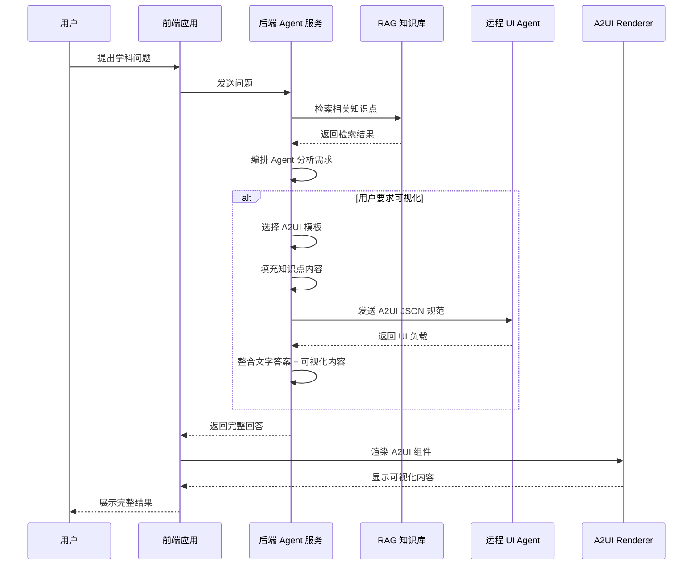
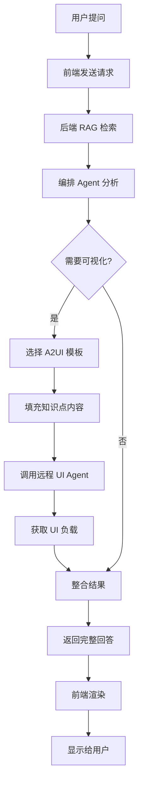

# A2UI 集成实现计划

## 1. 项目现状分析

### 1.1 现有架构
- **前端**：React + TypeScript，40+ 可视化组件，基础 A2UI 解析器
- **后端**：NestJS，VisualDesigner 服务，RAG 检索系统
- **数据**：完整的遗传学知识库，向量存储系统

### 1.2 优势
- 已有成熟的可视化组件库
- 后端具备完整的 Agent 流水线
- 前端已实现基础 A2UI 解析
- 丰富的 RAG 知识库支持

### 1.3 挑战
- 缺少标准 A2UI Renderer 集成
- 后端 Agent 输出格式需要标准化
- 缺少远程 UI Agent 调用机制
- 前端组件需要适配 A2UI 规范

## 2. 技术方案架构

### 2.1 系统架构设计

### 2.2 模块划分

| 模块 | 职责 | 技术栈 | 文件位置 |
|------|------|--------|----------|
| A2UI 模板管理 | 定义和管理 A2UI 模板 | TypeScript | `src/backend/src/modules/agents/data/a2ui-templates.data.ts` |
| 后端 A2UI 适配器 | 转换可视化数据为 A2UI 格式 | TypeScript | `src/backend/src/modules/agents/a2ui-adapter.service.ts` |
| 远程 UI Agent 客户端 | 与远程 UI Agent 通信 | TypeScript | `src/backend/src/modules/agents/remote-ui-agent.service.ts` |
| 前端 A2UI 注册表 | 注册自定义 A2UI 组件 | TypeScript | `src/frontend/src/components/A2UI/registry.ts` |
| A2UI Renderer 集成 | 渲染 A2UI 组件 | React + A2UI | `src/frontend/src/components/A2UI/Renderer.tsx` |
| AI 对话流程管理 | 处理 AI 对话和可视化触发 | TypeScript | `src/frontend/src/components/A2UI/ChatFlow.tsx` |

### 2.3 接口定义

#### 2.3.1 后端接口

| 接口 | 方法 | 路径 | 功能 |
|------|------|------|------|
| A2UI 模板获取 | GET | `/api/agent/a2ui/templates` | 获取所有 A2UI 模板 |
| 可视化转 A2UI | POST | `/api/agent/a2ui/convert` | 将可视化数据转换为 A2UI 格式 |
| 远程 UI Agent 调用 | POST | `/api/agent/a2ui/remote` | 调用远程 UI Agent |
| AI 对话 + 可视化 | POST | `/api/agent/chat/visualize` | AI 对话结合可视化 |

#### 2.3.2 前端接口

| 函数 | 参数 | 返回值 | 功能 |
|------|------|--------|------|
| `registerA2UIComponents()` | - | `void` | 注册 A2UI 组件 |
| `renderA2UIPayload()` | `payload: A2UIPayload` | `React.ReactNode` | 渲染 A2UI 负载 |
| `askWithVisualization()` | `question: string, concept: string` | `Promise<ChatResponse>` | 带可视化的 AI 对话 |
| `handleA2UIEvent()` | `event: A2UIEvent` | `void` | 处理 A2UI 事件 |

## 3. 分步实现计划

### 阶段 1：基础架构准备（1-2 天）

#### 任务 1.1：创建 A2UI 模板库
- [x] 实现 `a2ui-templates.data.ts`
- [x] 定义标准 A2UI 模板格式
- [x] 为主要可视化类型创建模板

#### 任务 1.2：扩展前端 A2UI 解析器
- [ ] 扩展 `a2ui-parser.ts` 支持更多组件类型
- [ ] 添加 A2UI 组件注册机制
- [ ] 实现 A2UI 事件处理

#### 任务 1.3：集成 A2UI Renderer
- [ ] 安装 A2UI Web Renderer
- [ ] 创建 A2UI 组件适配器
- [ ] 实现基础渲染功能

### 阶段 2：后端改造（2-3 天）

#### 任务 2.1：创建 A2UI 适配器服务
- [ ] 实现 `a2ui-adapter.service.ts`
- [ ] 集成 A2UI 模板管理
- [ ] 实现可视化数据转换

#### 任务 2.2：改造 VisualDesigner 服务
- [ ] 修改输出格式为 A2UI 标准
- [ ] 集成 A2UI 模板选择逻辑
- [ ] 优化 RAG 检索结果处理

#### 任务 2.3：实现远程 UI Agent 客户端
- [ ] 创建 `remote-ui-agent.service.ts`
- [ ] 实现 HTTP 客户端通信
- [ ] 添加错误处理和重试机制

### 阶段 3：前端集成（2-3 天）

#### 任务 3.1：创建 A2UI 注册表
- [ ] 实现 `A2UI/registry.ts`
- [ ] 注册所有可视化组件
- [ ] 配置组件映射关系

#### 任务 3.2：开发 A2UI Renderer 组件
- [ ] 实现 `A2UI/Renderer.tsx`
- [ ] 支持动态组件加载
- [ ] 处理 A2UI 交互事件

#### 任务 3.3：实现 AI 对话流程
- [ ] 创建 `A2UI/ChatFlow.tsx`
- [ ] 集成后端对话接口
- [ ] 实现可视化触发逻辑

### 阶段 4：功能整合（1-2 天）

#### 任务 4.1：整合 AI 速通功能
- [ ] 集成 A2UI 到 SpeedModePage
- [ ] 实现完整的对话-可视化流程
- [ ] 优化用户交互体验

#### 任务 4.2：添加错误处理机制
- [ ] 实现前端错误边界
- [ ] 后端异常处理
- [ ] 降级策略实现

#### 任务 4.3：性能优化
- [ ] 组件懒加载
- [ ] 数据缓存策略
- [ ] 渲染性能优化

## 4. 数据流转流程

### 4.1 正常流程

### 4.2 异常处理流程

| 异常类型 | 处理策略 | 降级方案 |
|----------|----------|----------|
| RAG 检索失败 | 使用默认知识点 | 基础文字回答 |
| 远程 UI Agent 超时 | 本地模板渲染 | 本地生成可视化 |
| A2UI 渲染失败 | 错误边界捕获 | 显示错误信息 |
| 模板匹配失败 | 使用通用模板 | 基础可视化 |

## 5. 技术可行性分析

### 5.1 技术可行性

#### ✅ 可行因素
- **成熟的技术栈**：React、TypeScript、NestJS 均为主流技术
- **已有基础**：前端具备 40+ 可视化组件
- **标准规范**：A2UI 提供完整的标准规范
- **可扩展性**：模块化设计，易于集成

#### ⚠️ 风险因素
- **A2UI 版本**：当前为 v0.8 预览版，可能存在 API 变更
- **远程依赖**：依赖远程 UI Agent 的可用性
- **性能挑战**：复杂可视化可能影响前端性能
- **集成成本**：需要适配现有 40+ 组件

### 5.2 风险评估

| 风险 | 概率 | 影响 | 缓解策略 |
|------|------|------|----------|
| A2UI API 变更 | 中 | 高 | 封装适配层，版本锁定 |
| 远程 Agent 不可用 | 低 | 中 | 本地降级方案，重试机制 |
| 前端性能问题 | 低 | 中 | 组件懒加载，虚拟滚动 |
| 集成复杂度 | 中 | 高 | 分阶段集成，优先核心功能 |

## 6. 测试验证策略

### 6.1 测试计划

#### 单元测试
- A2UI 模板管理服务
- 前端 A2UI 解析器
- 组件注册机制

#### 集成测试
- 后端 Agent 流水线
- 前端渲染流程
- 远程 UI Agent 调用

#### 端到端测试
- 完整对话-可视化流程
- 异常场景处理
- 性能测试

### 6.2 验证指标

| 指标 | 目标值 | 测试方法 |
|------|--------|----------|
| 对话响应时间 | < 3 秒 | 性能测试 |
| 可视化渲染成功率 | > 95% | 集成测试 |
| 异常处理覆盖率 | > 90% | 单元测试 |
| 用户满意度 | > 4.5/5 | 用户测试 |
| 兼容性 | 主流浏览器支持 | 兼容性测试 |

## 7. 部署与监控

### 7.1 部署策略
- **前端**：静态部署，CDN 加速
- **后端**：容器化部署，自动扩缩容
- **监控**：集成日志和指标监控

### 7.2 监控指标
- API 响应时间
- 可视化渲染成功率
- 远程 Agent 调用成功率
- 错误率和类型分布

## 8. 预期成果

### 8.1 功能成果
- 标准 A2UI 集成架构
- 完整的对话-可视化流程
- 远程 UI Agent 调用能力
- 统一的 A2UI 组件注册机制

### 8.2 业务价值
- 提升用户学习体验
- 标准化可视化输出格式
- 为跨平台扩展做准备
- 建立 Agent 驱动 UI 的标准模式

## 9. 后续扩展建议

### 9.1 功能扩展
- 移动端 A2UI Renderer 集成
- 更多可视化模板支持
- 个性化可视化推荐
- 交互式可视化增强

### 9.2 技术演进
- 拥抱 A2UI 正式版
- 实现增量更新机制
- 构建可视化组件市场
- 支持自定义 A2UI 模板

## 10. 结论

基于现有项目架构和 A2UI 标准规范，本方案技术上完全可行。通过分阶段实施，可以在保持现有功能稳定的同时，逐步集成 A2UI 能力，为用户提供更优质的可视化学习体验。

关键成功因素：
- 分阶段实施，优先核心功能
- 建立完善的错误处理机制
- 保持与现有系统的兼容性
- 注重用户体验和性能优化

预计总实施周期：6-8 个工作日，可根据实际情况灵活调整。
